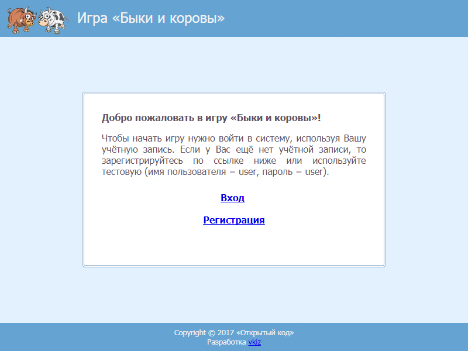

OpenCode test task web application
==========

В данном репозитории находится исходный код web-приложения, реализующего логическую игру "Быки и коровы".
Приложение разработано на языке Java с использованием Servlets, JSP, JDBC, HSQLDB.
Внешний вид графического интерфейса пользователя показан ниже.

Скриншоты отдельно:
[index](ui/index.png) 
[login](ui/login.png) 
[register](ui/register.png)
[begin game](ui/game-begin.png) 
[end game](ui/game-end.png) 
[rating](ui/rating.png)
[rules](ui/rules.png)

Инструменты для сборки
----------------------

* [Java Development Kit (JDK 8)](http://www.oracle.com/technetwork/java/javase/downloads/jdk8-downloads-2133151.html)
* [IntelliJ IDEA](https://www.jetbrains.com/idea)
* [Maven 3](https://maven.apache.org/download.cgi)

Зависимости
-----------

* [Tomcat 5.0.16](https://mvnrepository.com/artifact/tomcat/catalina/5.0.16)
* [HSQLDB 2.4.0](https://mvnrepository.com/artifact/org.hsqldb/hsqldb/2.4.0)
* [JUnit 4.12](http://junit.org/junit4)

Сборка и запуск
---------------

1. Выполните команду "mvn package"
2. Остановите Tomcat вызовом "%CATALINA_HOME%\bin\shutdown.bat"
3. Скопируйте файл "%PROJECT_DIR%\target\bulls-cows.war" в директорию "%CATALINA_HOME%\webapps"
4. Запустите Tomcat вызовом "%CATALINA_HOME%\bin\startup.bat"
5. Откройте в браузере страницу [http://localhost:8080/bulls-cows/index.jsp](http://localhost:8080/bulls-cows/index.jsp)
